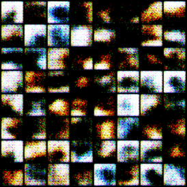

# DCGAN (Deep Convolutional Generative Adversarial Network)

__Link to Paper__ - _https://arxiv.org/abs/1511.06434_

## Introduction

Demonstrates minimal examples based on DCGAN on how to use `torchgan'. DCGAN is
one of the basic models that is supported out of box by `torchgan`. The 'torchgan'
implementation of DCGAN improves upon the original paper by auto-adjusting itself for variable
image sizes (as long as they are square images with dimensions being a perfect power of 2).

## Usage

```bash
python dcgan.py -dataset "cifar10" -losses "LeastSquaredGeneratorLoss LeastSquaredDiscriminatorLoss"
```
Thats pretty much it. There are 2 configurable options.

* `dataset` gives the option to choose between `MNIST` and `CIFAR10`.
* `losses` allows the user to provide a list of loss functions

## Results

| MNIST Least Squared Loss | MNIST Minimax Loss | CIFAR10 Minimax Loss |
|:------------------------:|:------------------:|:--------------------:|
||||

## Contributors

1. Avik Pal [@avik-pal]
2. Aniket Das [@Aniket1998]
