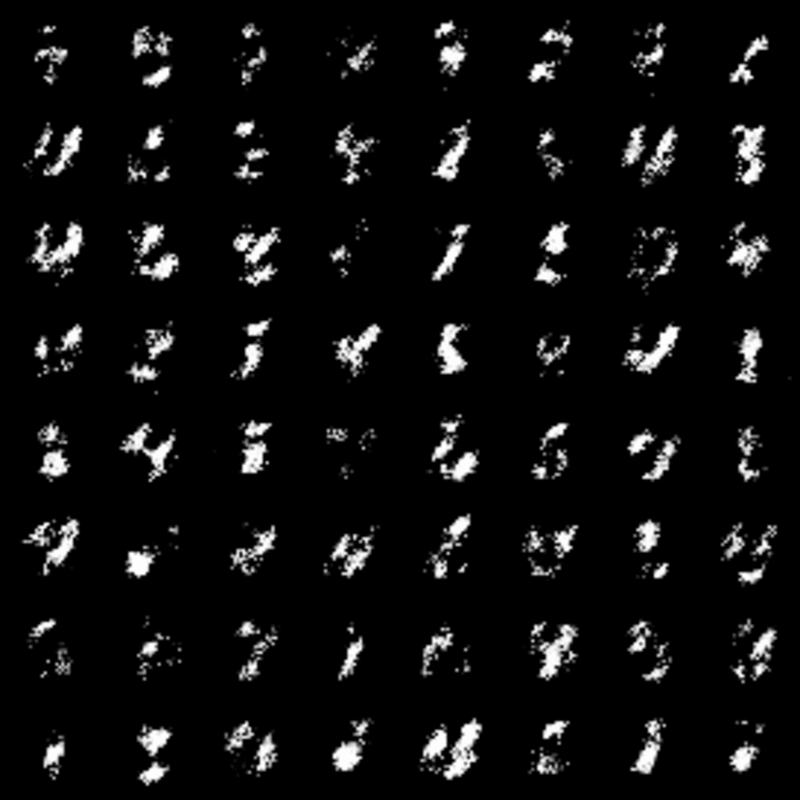
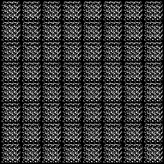

# DCGAN

## Introduction

Demonstrates minimal examples based on DCGAN on how to use `torchgan'. DCGAN is one of the basic models that is supported
out of box by `torchgan`. The 'torchgan' implementation of DCGAN improves upon the original paper by auto-adjusting itself for variable
image sizes (as long as they are square images with dimensions being a perfect power of 2)

## Usage

It is recommended that you use the `jupyter notebook` corresponding to these models. But in case you prefer
to use this, you need to set a few of the parameters:

1. Set the `root` to where you want to store the dataset.
2. If you donot have a GPU, pass a parameter `device = torch.device("cpu")` to the Trainer.

## Results

### DCGAN MNIST Least Squares Samples

### DCGAN MNIST Minimax Samples

### DCGAN CIFAR10 Minimax Samples

## Contributors

1. Avik Pal [@avik-pal]
2. Aniket Das [@Aniket1998]
